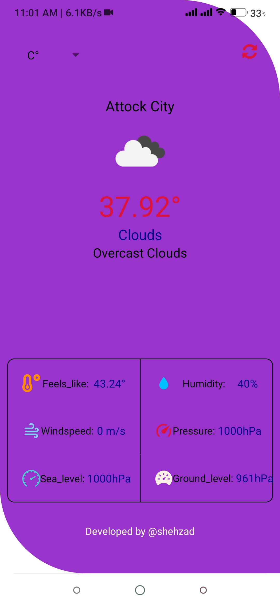

# weather_app
<h3>introduction:</h3>

This app is totaly buid in javascript framework react-native using expo-cli.
This app is basically for check weather temperature in celsius or in fahrenheit. 
This app also show your current location.

<h3>Major components:</h3>

  -use geolocation 
  -use api call(open weather api) 
  -use expo vector icons 
  -use several hooks(useState(),useEffect()) 
  
<h3>Running Command:</h3>

  -npm install -g expo-cli 
  -expo init yourprojectname 
  -expo start or npm start 

<h2>App layout:</h2> 

 
      

